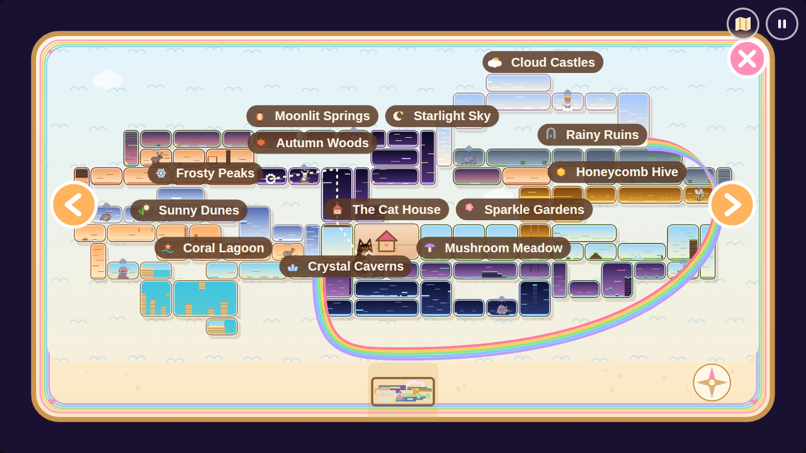

# Bubble Paws: The Rainbow Kingdom 🫧🐾

A cozy, non-violent platformer for little explorers (ages 3–7). Your kitten wakes up alone in the Cat House: a big gloom cloud has sent the whole family wandering off. Walk through the garden neighbourhood and through twelve hand-built biomes packed all round the house, blowing friendship bubbles to cheer up gloomy animals, and float home down the Starfall Shaft at the end for a big homecoming party. Bubble a family member at home and they jump up with a giggle and a silly line that says who they are. Then rescue Rainbow, and her own rainbow-coloured family turns out to be lost all over the kingdom too: find each one, send them riding a rainbow back home, and rescue her Mama from the Cloud Maze. At the end of every zone waits a big, very sad boss, each with its own silly animal moves and its own arena: dodge their slow, simple "sad attacks", then bubble them happy to open the way on. Solve picture puzzles, snack on fishy treats, learn hidden cat tricks, find the kittens' twelve lost family members, and unlock optional fun at home with collected stars and hearts. A grown-up picks **Easy** (extra jumping help), **Medium** (the former Easy), or **Hard** (happy suns and save-point returns). There's no game over, and play never depends on reading. A full adventure is a long one, so plan on an hour or more for a young player.

*Formerly called **Bubblebug**. Saves from the Bubblebug version carry over automatically.*


---

## ▶ How to play

**Windows:** double-click **`Play Bubble Paws.exe`** (or double-click `index.html`).
**Mac / Linux / tablets:** open `index.html` in Chrome, Edge, Safari or Firefox.
**Online:** enable GitHub Pages (Settings → Pages → deploy from `main`, `/ (root)`).

There's no install, no Node.js and no build step. Each region has its own recorded, seamlessly looping score (made with Lyria 3.5) and sound effects are generated in the browser; all 53 story and family voice recordings are bundled with the game, so playing never needs an API key.

All 53 spoken recordings use Gemini 3.8 Flash TTS: the twelve family greetings, a funny line from each family member when you bubble them at home, the story moments, the first-time guidance cues and thirteen lines for Rainbow's family. Every character keeps one voice for all of their lines; the narrator lines share one voice. Recording volumes are matched; music becomes quiet during speech. Mute stops voices immediately, and leaving a scene cancels queued lines. The recordings and pack manifest are in `assets/voice/gemini-3.8/`.

**Quick test of Rainbow's family:** open [the Rainbow family preview](index.html#play=rainbow&room=hm&demo=rainbow). It starts at home just after Rainbow's rescue, with every power, so you can go straight out to find her relatives and then Mama's Cloud Maze. Like the rewards preview, it never writes to or erases the normal adventure.

**Quick test of the additions:** open [the rewards preview](index.html#play=phoebe&room=hm&demo=rewards). It starts at home with 250 stars, 65 hearts, the family present and the homecoming complete. Rewards and progress in this preview never write to or erase the normal adventure. Open `index.html` to play normally. See [TESTING.md](TESTING.md) for a short playtest route.

| Action | Keyboard | Gamepad | Touch |
|---|---|---|---|
| Move | ← → or A D | D-pad / left stick | big ◀ ▶ buttons (slide your thumb between them) |
| Jump (hold = higher) | Space, ↑, W | A / Y | green ⬆ button |
| Blow a bubble | X, Z, J, E, Shift | B / X / bumpers / triggers | blue bubble button |
| Kingdom map (game pauses) | M or Tab | Select / Back | map button, top-right |
| Pause / home | Esc or P | Start | round pause button, top-right |
| Do a cat trick (once you've found one) | ▼ or S | D-pad down | orange smiling-cat/music button (appears after the first trick) |

Once unlocked, successive Jump taps give a normal jump, Double Jump, Bubble Bounce, then Star Wings flaps. Bubble always shoots, including in mid-air. Hold Jump to float or swim once those powers are learned. Glow works automatically: it lights dark places and opens the special glow-petal bridges; sleepy gate buds still need bubbles.

Touch buttons appear automatically on tablets and touchscreens.

On tablets and phones, *Add to Home Screen* (when the game is served online) installs it as a full-screen app called **Bubble Paws**, with the same icon as the Windows launcher.

### Title screen: Continue or New Game

The title screen has two big picture buttons:

- **▶ Continue** (green) goes straight back into the saved adventure, with the kitten it was saved with. A small tally beside it shows stars collected, hearts available, and family found. With no save yet, Continue is greyed out and does nothing.
- **🌱 New Game** (pink) goes to kitten select when there is no save. With a saved adventure, two big picture cards work without reading: the house and both cat families with crossed-out rewards restart the **whole game**; Rainbow's seven relatives with green ticks restart **only her family**, keeping everything else earned and returning you home. Circular arrows show replay, and a big green play arrow keeps the current adventure. Small captions are for adults. The family choice unlocks after rescuing Rainbow. The safe play arrow is selected first, including on the second full-reset confirmation. Difficulty and sound remain device settings.

Use ◀ ▶ and jump to choose, or tap/click.

In the bottom-right corner is a grown-up picker: **💗 Easy** (a winged heart bubble), **💗 Medium** (a heart bubble), or **☀ Hard** (a sun with a rain-cloud). Tap one, or press ▼ then ◀ ▶ (▲ goes back up). Easy is the default on a new device. Existing Easy settings and adventures become Medium, keeping their original movement; existing Hard settings stay Hard. The choice is remembered on this device and applies to Continue and New Game alike. Change it from the title screen at any time (pause → home).

---

## 🐾 The heroes

Both kittens are painted from photos of two real cats:

- **Marshmallow**, a fluffy cream Birman kitten. She has warm taupe points on her ears, mask and plume tail, a dark little nose, snowy white "gloves", and sapphire-blue eyes. Her bubbles are lilac and pink with a trail of tiny hearts. She loves a big sleepy yawn.
- **Phoebe**, a patchwork tortoiseshell-tabby. Phoebe has chocolate and ginger patches with tabby stripes, a white bib and paws, a ginger cheek and bright green eyes. Phoebe's bubbles are honey-gold and mint with a sprinkle of stars. Phoebe twitches an ear, licks a paw, and does a wiggly pounce-crouch.

Both move the same way. They differ in voice (a synthesized *mew*), idle habits and bubble style.

Find all twelve family cats to open the small rainbow door inside the left side of home. Beyond it is a grand, gloomy courtyard and a majestic doorway into the Rainbow Garden maze. Rescue **Rainbow**, a magical kitten with a flowing rainbow tail, a rainbow mane and a golden unicorn horn. Choose any of the three as your playable kitten, then change again at the mirror. Your adventure progress and outfits carry over. Rainbow then asks for help: her own family is lost too (see *Rainbow's family* below). Nothing is reset for this.

## 🗺 The Rainbow Kingdom

The kingdom is one compact block with the **Cat House** in the middle: sky across the top, caves right under the house, and the sea along the bottom-left. Out of the front door, a continuous garden path leads through three outdoor rooms and the Golden Gate into Sparkle Gardens, east of the house. A leafy drop takes you down into Mushroom Meadow, a glowing glen under the gardens and the house, and the Old Well drops you into the Crystal Caverns right under your own floor. The **Golden Tower** (Sticky Paws climb its sheer walls) rises beside the house through the glen and the garden path up to the Honeycomb Hive above; the Rainy Ruins and the Cloud Castles climb on above that. From the far end of Cloud Castles, the **🌈 Rainbow Lift** swoops round the outside of the kingdom to the Coral Lagoon's beach, bottom-left. From there the Sunny Dunes, Frosty Peaks and Autumn Woods climb the west side, and the Moonlit Springs run along the very top to Starlight Sky, whose tall **Starfall Shaft** stands right above the Pawprint Maze room beside the house. From the start you can see where you are heading: up.

**Never lost: the "this way!" guide.** A bouncing golden arrow marks the way on: to an elder whose power you still need, then to the next sad boss, and once every boss is happy, to the family cats still lost. It shows the doorway, vine gate, cat flap, lift or fairy ring to take, or, when that is off screen, a soft arrow at the edge of the screen. It never points against a wooden signpost (where they would disagree, it stays quiet and the signs lead) and steps aside while a boss is sad. **Easy:** always shown. **Medium:** for a few seconds in each new room, then whenever you stand still for 2 seconds. **Hard:** only after 4 still seconds.

Short link rooms join the zones (climbing shafts, little bridges, a root tunnel); each has arrow signposts pointing onward, and a cozy bench and a full bowl wait after each of the three long climbs (the Golden Tower, the west-side climb and the Starfall Shaft). Every boss arena has a cat flap, so after each boss there's a short way home.



Every zone has about six rooms, gloomy critters, sparkles, a picture puzzle, a hidden toy, cozy benches, a cat flap home and, at its far end, a boss to cheer up. Ten of the zones also have an elder with a new power. Each new power opens the way to the next zone, and many earlier corners too.

| Zone | What happens there | Elder's gift |
|---|---|---|
| 🌼 **Sparkle Gardens** | Tutorial: hops, a gloomy bunny to cheer up, a harmless pond, a cozy bench, a secret inside a hill | – |
| 🍄 **Mushroom Meadow** | Bouncy toadstools up to the glowing grove | 🦋 **Double Jump** |
| 💎 **Crystal Caverns** | A gentle drop down the Old Well into cozy-dark caves | 🐌 **Sticky Paws** (wall climb) |
| 🍯 **Honeycomb Hive** | Climb the golden tower | 🪲 **Glow** (wakes glow-petal bridges) |
| 🌧 **Rainy Ruins** | Soft rain, broken towers, wide pools | 🌸 **Dandelion Float** (hold jump to drift) |
| ☁ **Cloud Castles** | Breezy updrafts, sky bridges, and the grumpy Cloud King. Once he smiles, the Rainbow Lift swoops you round to the lagoon | – |
| 🐚 **Coral Lagoon** | Sunny beach, tide pools, a deep kelp forest and a sunken ship | 🐢 **Swim** (a bubble helmet: hold jump to paddle up, leap out like a dolphin) |
| 🌵 **Sunny Dunes** | Sandstone canyons under a huge sun | 🐢 **Mighty Paws** (cracked sandstone crumbles at a touch) |
| ❄ **Frosty Peaks** | Snowy pines and glassy ice walls too slippery to climb | 🐇 **Spring Paws** (a much bigger jump) |
| 🍁 **Autumn Woods** | Falling leaves and sleeping fairy rings | 🦡 **Fairy Rings** (step in one, pop out of its matching twin) |
| 🏮 **Moonlit Springs** | Bamboo, lanterns and steamy pools | 🦦 **Bubble Bounce** (tap Jump a third time to spring off a bubble) |
| 🌙 **Starlight Sky** | Crystal grass under the stars, and the tall Starfall Shaft | 🐋 **Star Wings** (keep tapping jump to flap higher and higher) |

At the very top of the Starfall Shaft, just past the Moon Rabbit, a great glowing dandelion waits: the **🌼 Starfall float**. Take hold and it drifts you over to the shaft and all the way down it, the camera gliding along, to land by the rainbow (Pawprint Maze) door in the living room. That's the end of the adventure (see *The Cat House* below).

The map isn't a single line. Side passages, high walkways, shy walls, underwater tunnels and fairy rings branch off the main path. Some can only be reached with a power from a later zone, so it's worth going back.

### 🌿 A neighbourhood around home

The house and the opening garden share one moving camera: no teleport, fade or frozen room slide interrupts the walk. A broad lower path reaches the tutorial without jumping. An optional branch walkway connects the garden, pond and roots above it, with easy steps up and down at either end. Shared fences, trees, flowers and roots carry the scenery across each boundary.

| New room | Size | Connection and play | Extra stars |
|---|---|---|---|
| Front Garden | 30 × 34 tiles | Invite rescued friends at the outdoor welcome board and play ball; leaf steps lead to the upper loop | 8 |
| Pond Walk | 30 × 34 tiles | A safe wooden bridge, a branch above and bubble play with garden friends | 8 |
| Root Hollow | 30 × 34 tiles | Dance with friends; bubble two sleepy buds to open an optional star nook upstairs; walk east into Sparkle Gardens | 8 |
| Rainbow Garden / Pawprint Maze | 29 × 15 maze cells | Twelve family portraits unlock the indoor rainbow door; a grand courtyard leads to a gloomy hedge maze with matching lantern gates | 12 |

The small rainbow door opens when all twelve family cats have been found. Its twelve portraits match the family wall, so missing cats are visible without reading. Walk into the courtyard, stand at the tall doorway or press Confirm/Bubble there, then choose the green check to enter the maze. The maze has no enemies or jumps: use all four arrows, WASD, a D-pad or its on-screen direction buttons. Find the moon, flower and star lanterns in that order: each opens its matching arch to reveal the next garden section. Rescuing Rainbow turns the gloomy maze and courtyard bright and offers Marshmallow, Phoebe or Rainbow as your playable character. Walk left through the opening beside Rainbow onto its house-picture door and wait two seconds to return to the courtyard. Walk right outside to reach Cat House; the top house button and lower-right entrance also remain available. The mirror's cat tab stays unlocked afterwards, including in replays. Existing maze stars, lantern/paw keys and saved positions keep their progress; older saves already inside the maze can finish their existing route before using the new gates on their next entry.

Maze exits wait two seconds while a golden paw ring fills. Moving into another corridor cancels the wait. Returning to the starting house icon starts the countdown; entering a new maze leaves plenty of time to look around there. The house button and rescue exit use the same wait. Automatic doors, cat flaps, lifts, the wardrobe and garden activities wait about one second of standing still. Walking away clears their progress. Progress rings sit above the kitten, hats and scenery with a clear background; deliberate Confirm/Bubble shortcuts still open garden choices directly.

Every rescued critter of an invited species comes to live in the Front Garden, Pond Walk or Root Hollow, including later rescues of that species. Invite each species once for one heart at the outdoor welcome board. Each card has just one switch for its selected species. A heart and lock show that one heart is needed to unlock it; afterwards the switch shows or hides that species for free. The choice survives Continue without losing invitations or rescued hearts. Left/Right selects a species; Confirm/Bubble or tapping its slider unlocks or changes that one switch. All 65 rescued critters can live along the garden floor and upper branches. Flower beds, flags and pinwheels decorate the path from the start. Stand on the ball, bubble-wand or smiling-cat dance ring, or press Confirm/Bubble there, to play together for eight seconds. Up to six nearby ground-level visitors gather in spaced places while the others roam calmly. They ease back home after playing, with no abrupt hops or snaps. Games, petting and blowing bubbles at visitors are free and never award another collectible heart. Step away to play again.

Once Rainbow's whole family is home, a sad cloud appears near the rainbow door. It offers the same picture choices as New Game: restart **everything**, or find **only Rainbow's family** again. The green play arrow is selected first; erasing the full adventure requires another picture confirmation, also defaulting to the safe green arrow. A family-only reset keeps your chosen kitten, the twelve house cats, critters, stars, hearts, powers, clothes, puzzles, invitations and fountain, and places you at home. Find the six relatives and finish Mama's Cloud Maze again to reveal the cloud for another replay. A full reset returns to kitten selection with all adventure progress cleared. Ordinary Continue and save migration preserve the current adventure.

### 🌈 Rainbow's family (right after rescuing Rainbow)

Rescue Rainbow and she thanks you, then shares her news: the gloom cloud took the colours from her own family too. They are lost all over the kingdom, in the same adventure, with nothing reset. A picture card shows six grey relatives and an arrow to the Cat House. There is one relative for each colour of her rainbow, and each is a little unicorn cat like her:

| Colour | Who | Where they're lost |
|---|---|---|
| 🧡 orange | Pumpkin, her big brother | a high branch above Acorn Hollow, Autumn Woods |
| 💛 yellow | Rainbow's Papa | a perch above the honey island, Honeycomb Hive |
| 💚 green | Rainbow's Grandpa | the branch walk over Pond Walk, right by home |
| 🩵 teal | Splash, her big sister | a perch over the beach, Coral Lagoon |
| 💙 blue | Rainbow's Granny | a high cloud ledge, Cloud Castles |
| 💜 purple | Twinkle, her baby sister | a starry ledge, Starlight Sky |
| 💗 pink | Rainbow's Mama | the Cloud Maze, behind the courtyard doorway (last) |

- **Lost and grey.** A lost relative sits drained of colour under a little rain cloud, now and then wiping a tear. Walk into a room where one is lost and a soft chime plays while little guiding stars float toward them.
- **A happy maze for each one.** Walk up to a lost relative and their own little maze opens. They sit grey and sad in a corner, and three of their favourite things are hidden in the maze; gather all three (they fill in at the top), then reach them. Every maze is a different place with its own small twist:

  | Relative | Their maze | Favourite things | The twist |
  |---|---|---|---|
  | Grandpa | Lily Pond | flowers | none: a gentle first maze |
  | Papa | Honeycomb | honey pots | friendly bees buzz up and down two corridors; wait a moment for one to fly past |
  | Granny | Knitting Basket | yarn balls | slippery wool: you slide until something stops you |
  | Splash | Coral Reef | shells | currents carry you along their arrows |
  | Pumpkin | Misty Wood | acorns | mist: only the path near you shows (walked paths stay lit) |
  | Twinkle | Starry Sky | stars | each star you find makes a starry bridge appear |

  Nothing can hurt you and you can't get stuck; leave with the house button and they wait for another try (step away and come back).
- **Found!** Their colour floods back under a little rainbow and they say hello in their own voice. Back in the kingdom they hop onto a cloud and ride a rainbow up and away, back to the beginning: the Cat House.
- **The Rainbow Nest.** Over the Cat House stairwell stands a big seven-band rainbow with a cloud cushion for each relative. Each band lights up in its colour when its cat comes home.
- **Easy to follow.** A little rainbow next to the stars and hearts at the top fills in band by band. On the map, every lost relative flashes in their own colour where they wait; ones off to the side flash at the edge of the map with an arrow (tap one to glide there). The Continue button on the title screen shows the little rainbow too.
- **The courtyard doorway waits for them.** While any of the six is lost, the tall doorway is shut: their six faces hang above it, grey until each one is home, and Mama waits sadly inside. With all six home, Rainbow says so, Mama calls for help, and the doorway opens.
- **Mama's Cloud Maze.** A sunset maze of clouds, nothing like the green hedge maze. The six relatives came back to help, each waiting on a cloud with their own colour. Touch one and their colour is yours (a dot fills at the top), and every bridge of that colour turns solid. Closed bridges are clouds tinted in the colour that opens them, showing the face of the relative who opens them, and wobble if you bump into one. Stand still a moment (or bump a closed bridge) and a trail of golden sparkles shows the way to the next relative you can reach. Each colour leads to the next relative, the family follows you in a little parade, and the last bridge, a whole rainbow, needs all six colours to reach Mama. Colours are kept if you leave early, so nobody can get stuck.
- **The whole rainbow.** With Mama rescued the family gathers under a big rainbow, fireworks go up over the courtyard, and the kittens' bubbles turn into **rainbow bubbles**, kept for every later adventure (Rainbow herself keeps her rainbow beams unless you change them at the mirror). Everyone who is home dances at the homecoming party.

Rainbow's family stays home until you choose a reset. The family-only choice makes their seven cushions empty again without losing your other progress or earned rainbow bubbles.

### 🏠 The Cat House

The adventure starts at home, and nobody's there. The kitten wakes on its bed, stretches, and wonders where everyone went (a thought bubble shows three grey "?" faces) while a big gloom cloud drifts past the window. Around the house are the empty cushions, twelve empty picture frames on the family wall, cat trees to climb and a door hall upstairs. The way out is always clear: until you've been out once, the big front door glows with sunbeams under a bouncing arrow, big glowing paw prints lead from the bed to it, and if the kitten waits, a sparkle flies over to show the way.

- **Easy to spot.** Every way home glows: a column of light with sparkles rising, a bobbing house sign on top, and a bouncing arrow over any flap you haven't reached yet. Come close to a flap, a door, the lift or the mirror and a dotted paw ring shows where to stand still. Once you've used one, its arrows and rings go away (the glow stays).
- **Cat flaps.** Every zone has two cat flaps: one near its start (in Sparkle Gardens it's the garden gate) and one in its boss arena, by the way on. The boss's flap stays shut (grey, with a vine across it) until that boss is happy again.
- **Cheering up a boss opens the next door.** The moment a boss is happy, the Cat House door to the next zone opens by itself, and glows with a bouncing arrow until you've been through it. Walk past a flap and that zone's door lights up at home; stand in it for a moment (a golden paw ring fills up) and you pop home beside that door. The upstairs doors return you to the furthest flap reached in their zone. Sparkle Gardens' front door is the physical garden route, so that zone is reached by walking outside.
- **The door hall.** Each zone's door is dressed as its zone: painted in its colours, trimmed with its flowers, crystals, honey, shells, icicles, leaves, lanterns or stars, with a round window onto its sky and its big emblem on a sign on top. Doors to zones you haven't reached yet are grey and shut. The door to the zone you were in last glows, sparkles and has a bouncing arrow over it.
- **The front door** opens straight onto the Front Garden at the right of the living room. Keep walking east through the pond and roots to reach Sparkle Gardens. At the left of the living room is the optional Pawprint Maze.
- **Family come home.** Each family member you find hops off home. Their frame on the family wall fills in with their face, and next time you're home they're napping on their own cushion (and wake up for a cuddle when you come close). Your own Mama waits by the front door.
- **The homecoming party.** Float home down the Starfall Shaft and the party starts in the living room. Only the family you actually found come: they dance in a ring around your kitten (the grannies sway, the babies bounce). Every friend you made floats in on a little cloud, and every boss you cheered up waves from the landing upstairs. Then a big card fills in the family frames one by one and shows how many you found, like **9 / 12**. Find all twelve and the card turns rainbow, with extra fireworks. Afterwards you can keep playing and go back out for anyone you missed.
- **Rainbow beams.** Rainbow doesn't blow bubbles: she sweeps a paw forward and casts a flowing seven-colour rainbow with a star at its tip, which blooms into a little rainbow where it lands. After her rescue, **Rainbow beams** is also a choice in the mirror's Bubbles tab, and Marshmallow and Phoebe cast them from their paws too. Each kitten keeps her own bubble choice. A beam cheers a sad boss right up in one go, even mid-attack: every gloom cloud pops at once and the way on opens as usual.
- **Dressing up.** Every boss still gives its original free present: a bonnet, mushroom hat, tiara, honey crown, unicorn horn, cloud collar, sailor hat, sun hat, bobble hat, scarf, nightcap or bunny ears. Hidden corners also hold Googly glasses inside Root Hollow's two-bud nook, a silly nose-and-moustache disguise in the crystal grotto and star shades in the coral garden. Discoveries are free and equip on pickup. The mirror has five picture tabs: Hats, Necklaces, Glasses, Bubbles and Trails. Earned presents join their matching clothing category; hidden glasses and scuba gear share Glasses. Page dots browse longer categories. Up focuses categories; Left/Right changes category; Down returns to items. A sixth kitten tab appears after rescuing Rainbow. A hat, neck item and face accessory can be worn together.
- **Toys come home too.** Every hidden toy you find turns up somewhere in the house: the yarn ball on the rug, the jingle bell hanging from a cat tree, the paper boat on the windowsill, the star cushion on the sofa… Walk into one to bat it about and hear its own sound. The spots for toys you haven't found yet show a faint outline.
- The house has its own gentle music-box score. The party tune plays only while you're at the party; step out of the house and the music changes with you.

### ⭐ Stars for you, hearts for friends

Stars unlock permanent milestones from the total collected; equipping never spends stars. The mirror shows the selected item's own progress bar and a picture of its requirement, without numeric prices or remaining counts. Only earned items have full bars. Star rewards fill with collected stars; activity rewards fill with their saved achievement progress; hidden glasses stay empty until discovered. Thirteen star rewards can also be **found** out in the kingdom (see below), so a kid who finds one gets it straight away; its star milestone still unlocks it if it's never found. Previous purchases remain owned even below their new milestone. Hearts still use a separate **found − spent** ledger for one-time invitations and fountain unlocking. Collected sparkle/friend keys, map ★ marks, bosses, family, toys, powers and completion stay intact.

| Place | Optional extra | Unlock / cost |
|---|---|---|
| Mirror · hat picture | Party hat / flower crown / chef hat | Collect 25 / 50 / 75 stars |
| Mirror · hat picture | Wizard hat / pirate hat | Collect 100 / 125 stars |
| Mirror · necklace picture | Sparkly collar / jingle collar | Collect 150 / 175 stars |
| Mirror · glasses picture | Scuba mask & snorkel | Collect 200 stars |
| Mirror · glasses picture | Heart glasses | Collect 300 stars |
| Mirror · glasses picture | Flower glasses / moon glasses / explorer goggles | Bloom all 4 buds / find 4 family cats / rescue 16 critters |
| Mirror · necklace picture | Bow tie / pearl necklace | Find 3 toys / finish both bell songs |
| Mirror · necklace picture | Leaf collar / rainbow necklace | Learn 3 tricks / rescue Rainbow |
| Mirror · bubble picture | Heart / star / flower bubbles | Collect 40 / 80 / 140 stars |
| Mirror · paw picture | Tiny paw trail / rainbow trail | Collect 60 / 250 stars |
| Mirror · paw picture | Heart trail | Cheer up 3 bosses |

**Found or earned.** Each zone hides one of the star rewards somewhere off the beaten path. Find it and it goes straight on; the mirror then shows it earned. Still hidden, it shows its star bar plus a small purple **?** spot, and its clue shows the zone it hides in next to the star.

| Zone | Find it… | Or collect |
|---|---|---|
| Sparkle Gardens | Party hat, high on the Tall Garden's top ledge | 25 ★ |
| Mushroom Meadow | Flower crown, on the Mushroom Canopy's tallest cap | 50 ★ |
| Crystal Caverns | Sparkly collar, on a ledge in Glimmer Hall | 150 ★ |
| Honeycomb Hive | Chef hat, in the bees' nook off the Wax Gallery | 75 ★ |
| Rainy Ruins | Flower bubbles, on a broken tower above the courtyard | 140 ★ |
| Cloud Castles | Star bubbles, on the cloud balcony | 80 ★ |
| Coral Lagoon | Pirate hat in the Sunken Ship's cabin, and a scuba mask in a tide pool | 125 ★ / 200 ★ |
| Sunny Dunes | Tiny paw trail, under the sandstone floor | 60 ★ |
| Frosty Peaks | Jingle collar, on the icy ledge (Spring Paws) | 175 ★ |
| Autumn Woods | Heart bubbles, in the Hollow Log through a fairy ring | 40 ★ |
| Moonlit Springs | Heart glasses, on top of the ice wall (Bubble Bounce) | 300 ★ |
| Starlight Sky | Wizard hat, in the Comet Nook | 100 ★ |

The googly glasses, silly disguise and star shades are still found in Root Hollow, the crystal grotto and the coral garden; the rainbow trail and the activity rewards stay earned, not found.
| Front Garden · welcome board | All rescued critters of an invited species, including later rescues | 1 heart per species |
| Outdoor play rings | Ball play, bubbles and dancing with garden friends | Free; step away to repeat |
| Living room · heart fountain | Unlock fireworks, family dancing and the extra twirl trick | 1 heart once; every repeat is free |

At the mirror, tap a picture to preview it; tap the selected picture again to equip it if unlocked. Keyboard/gamepad users press Up from the first item row to focus categories, Left/Right to change category, then Down to browse its pictures. Jump, bubble or Enter equips. There are eight glasses, eight collars/necklaces and four trails. Glasses and collars each fit an evenly spaced two-row grid, including locked choices; longer hat collections use page dots. Cards use pictures and short item names, without navigation arrows or long control hints. Touch movement buttons hide while menus are open and return when playing; the map button stays available to close its overlay. Rewards earned through activities are saved immediately and stay available through Rainbow replays. The original bubbles and trail remain free options, and earned boss presents remain free to wear. Styles change appearance only. The jingle collar uses an existing bell sound when running.

The Front Garden has broad climbing steps, an open upper entrance and a trampoline in the middle of the lower path, clear of the ball games, that works without learned jump skills; bouncing on it reaches a little treat ledge with a sparkle. Short gaps add hops to the high garden and pond branches. Ball play uses gravity, rolling friction, bounces and kitten kicks; the same ball can travel across Front Garden, Pond Walk and Root Hollow for the current play session, even after the gathering ends.

Invited critters wander through the neighbourhood, and approaching them gives a purr and hearts animation. Soft fur and shell shading, bright eyes, breathing, ear twitches, tail wags, paw lifts and landing squashes bring their original vector art to life. Friends look at the nearby kitten, greet it and dance with an advancing pose even during garden games. These animations leave movement, hitboxes and saved progress unchanged. Petting never spends or awards currency. The fountain closes its card immediately for a six-second show of rainbow jets, flying hearts, confetti, fireworks, party music and family dancing. The first-use twirl card appears afterwards. Step away before using a paw ring again. These additions use sounds and animations, with no new speech lines.

There are 39 friend species and 65 hearts in the world. One heart per species plus one for the fountain lets a completed adventure afford every current heart reward.

### 👪 The kittens' family

Twelve of Marshmallow's and Phoebe's relatives are hidden, one in each zone, down a secret side passage or walkway. Each one is napping on a cushion; come close and they wake with a happy mew and a shower of hearts, then hop off home to the Cat House. A cat face on the HUD counts how many you've found, and a cat face on the map marks where.

| Zone | Who's hiding there | Zone | Who's hiding there |
|---|---|---|---|
| Sparkle Gardens | Marshmallow's Mama | Coral Lagoon | Marshmallow's big sister (in the sunken ship) |
| Mushroom Meadow | Phoebe's Mama | Sunny Dunes | Phoebe's big brother (behind the sandstone) |
| Crystal Caverns | Marshmallow's Papa | Frosty Peaks | Marshmallow's baby brother |
| Honeycomb Hive | Phoebe's Papa | Autumn Woods | Phoebe's baby sister (through a fairy ring) |
| Rainy Ruins | Marshmallow's Granny | Moonlit Springs | Marshmallow's Grandpa (through a fairy ring) |
| Cloud Castles | Phoebe's Granny (on the Star Balcony) | Starlight Sky | Phoebe's Grandpa (in Comet Nook) |

Marshmallow's family are Birmans and Siamese-pointed cats in cream, lilac and chocolate. Phoebe's family are tabbies, torties and a calico. Grannies and grandpas wear glasses, and the babies are tiny.

### 🐰 The gloomy critters

| Zone | Who needs cheering up |
|---|---|
| Sparkle Gardens | bunny, hedgehog, bluebird, ladybug |
| Mushroom Meadow | frog, mouse, caterpillar, beetle |
| Crystal Caverns | mole (with a tiny miner's lamp), bat, pillbug, beetle |
| Honeycomb Hive | bear cub (hugging a honey pot), bee, beetle |
| Rainy Ruins | owl, turtle, duckling, spider, snail |
| Cloud Castles | lamb, bluebird, moth |
| Coral Lagoon | crab, seal, jellyfish, clownfish |
| Sunny Dunes | fennec fox, meerkat, lizard, scarab beetle |
| Frosty Peaks | penguin, polar bear cub, arctic fox, owl |
| Autumn Woods | squirrel, fawn, raccoon, hedgehog |
| Moonlit Springs | capybara (with an orange on its head), snow monkey, koi |
| Starlight Sky | baby dragon, unicorn, bunny, lamb, bat |

Bunnies and frogs hop, birds, bats, owls and bees flutter, fish and jellyfish swim, spiders dangle on silk, and everyone else waddles. Every friend you make comes to the rainbow party.

The world has 103 interconnected rooms (87 places plus 16 small link rooms, the Cat House included), 860 sparkles, 65 gloomy critters, 12 bosses, the original 12 picture puzzles plus the new maze, 12 hidden cat tricks plus the fountain twirl, 16 hidden things to wear (three funny glasses and thirteen treasures), 87 fishy treats, 17 food bowls, 28 cozy benches (your own bed at home among them), 24 cat flaps (two per zone), 12 family members and 12 hidden toys (yarn ball, feather wand, jingle bell, toy mouse, paper boat, star cushion, seashell, sand bucket, mitten, kite, rubber duck, toy rocket). There are also guide fireflies, music flowers, sleepy buds that open vine gates when bubbled, and shy walls you can walk right through.

### ✨ Little touches

Grass and flower tufts bend as your kitten brushes past, then spring back. Paw prints press into snow and sand and slowly fill back in, crunchy leaves kick up in the Autumn Woods, water ripples wherever you splash, underwater light dances in the Coral Lagoon, and soft light shafts slant down in the sunny and moonlit zones. Bosses squash and stretch, wind up before every move, and warm from grey to full colour as their clouds pop. Lost babies and the golden key follow your kitten's exact path.

## ☀ Easy, Medium or Hard

A little gentle danger, never a game over. How much is up to the grown-up picker on the title screen:

- **💗 Easy** (default for new players): harmless bumps, longer late-jump grace and jump buffering, a larger ledge pop-up, a few extra pixels of exposed-edge landing grace, stronger air steering and a slightly floatier descent at the jump's peak. Jump height and powers stay the same.
- **💗 Medium**: the original Easy movement and harmless bumps, exactly as before. Old Easy players keep this mode automatically.
- **☀ Hard**: original movement and the happy suns below, unchanged.

On both Easy and Medium, gloomy critters and sad attacks only knock the kitten back with a silly *boing*. No suns are lost and nobody ever gets too sad. Tumbling into water or mist still returns the kitten to safe ground on dandelion fluff.

On Hard:

- **Four happy suns** sit next to your kitten's picture at the top-left. Bumping into a gloomy critter, getting caught by a boss's sad attack, or tumbling into water (before you can swim), sky-mist, steam or the starry void costs one sun. The kitten bounces back with a soft *ouch* and blinks for a moment, and nothing can make it sadder while it blinks.
- **Too sad?** With no suns left, the kitten sits down for a little cry, the picture closes into a circle, and it pops back at the **latest save point** with all four suns shining again. Everything collected stays collected, and a boss remembers every gloom cloud you already popped.
- **Save points** are everywhere: the first safe spot you stand on in each new room lights a little paw-print lantern, and sitting on a cozy bench saves too. Every boss arena has a bench right by its door.
- **Cheering back up:** a fishy treat or making a new friend gives a sun back. A food bowl, a nap on a cozy bench, finding a family member, getting an elder's gift or cheering up a boss fills every sun again.

As the suns run out, your kitten shows it: ears droop, brows tilt and the smile turns into a wobbly frown, so even a non-reader can tell when it's time to be careful.

## 🐾 Cat tricks

Twelve cat tricks are hidden around the kingdom, one in each zone, each inside a **smiling-cat music bubble**. Touch one and your kitten learns the trick: a little card shows it doing the trick next to the button that does it. After that, press **▼** (S, a gamepad's D-pad down, or the orange smiling-cat/music button on a touchscreen) and your kitten does a trick. Each press does the next trick it knows, round and round. The tricks are just for fun; moving, jumping or blowing a bubble stops one straight away, and the smiling-cat symbol with a count at the top shows how many you've found. Press ▼ before finding any and your kitten wonders about it in a little "?" thought bubble.

| Zone | Trick | Zone | Trick |
|---|---|---|---|
| Sparkle Gardens | 👋 a big paw wave (and a *mew*) | Coral Lagoon | 👅 a blep: just the tip of the tongue |
| Mushroom Meadow | 🐾 wiggle wiggle… pounce! | Sunny Dunes | 🌀 chasing its own tail |
| Crystal Caverns | 😌 a slow blink, the way cats say "I love you" | Frosty Peaks | 🍞 a cozy bread-loaf tuck |
| Honeycomb Hive | 🍪 making biscuits (kneading, purring) | Autumn Woods | 🧼 a paw-lick face wash |
| Rainy Ruins | 🤧 ah… ah… achoo! | Moonlit Springs | 🙆 a big stretch and a yawn |
| Cloud Castles | 🔄 a roly-poly roll | Starlight Sky | 💃 a hoppy happy dance |

The Sparkle Gardens trick waits right on the main path, so every young player learns ▼ early. The others are tucked up high, at the tops of shafts, towers and ledges, and some are only reachable with a later power, which is a good reason to go back.

The optional heart fountain adds a thirteenth trick, a happy twirl, to the same ▼ cycle.

## 🐟 Cat food

Snacks are dotted all over the kingdom: **70 fishy treats** (golden fish biscuits bobbing over the ground, often on a ledge worth a jump) and **12 food bowls** (one per zone, heaped with kibble and a fish on top). Walk into one and your kitten munches it: crunchy *nom nom* sounds, chubby chewing cheeks, a lick of the lips and a shower of crumbs.

- On **Hard**, a treat brings back one happy sun and a bowl brings back all of them.
- On **Easy and Medium**, they're just for fun: hearts float up and the heart in the corner gives a happy squeeze.

Snacks always come back: a treat pops back after half a minute (or as soon as you leave the room), and an empty bowl slowly fills up again. In every boss fight, each gloom cloud you pop also bounces a treat out onto the floor, on your side of the arena. Every arena has two treats of its own as well.

## 🔊 Sounds and a friendly voice

The big moments have their own sounds, and a friendly voice says what happened, so nobody needs to read. It uses the device's own speech voice, works offline, and stays quiet when the sound is off.

- **Family found:** a warm reunion tune, both cats mew, and the voice says *"You found Phoebe's Mama!"*.
- **Toys:** every toy has its own sound, both when found and when batted at home: a jingling bell, a squeaky mouse, a tooting boat, a quacking duck, a whooshing rocket, the sea in a shell… The voice says *"A jingle bell!"*.
- **Bosses:** a cheered-up boss says so in its own animal voice (a honk, a ribbit, a trumpet, a lion-cub rawr, moo, ork-ork…) over a happy fanfare, and the voice says *"Hooray! The goose is happy!"*. Then its present pops up: *"You got a goose bonnet!"*.

## 🌧 The bosses: twelve big sad friends

Every zone ends in an arena with a big animal having the saddest day ever. Nobody is mean; their sadness just spills out as slow, silly "sad attacks" that suit the animal, and every one is shown before it happens. Each boss has its own arena too. The rhythm is always the same, so little players learn it fast:

1. **Wake up.** Walk in and a picture card shows the plan: sad boss → bubbles → happy boss.
2. **Dodge.** The boss winds up with a clear wiggle, then does one sad attack (see the table). Things that fall show a growing shadow first, hops and dives show a ring where they'll land, and the toad's tongue shows a dotted line.
3. **Bubble!** Every attack ends with the boss stuck or sitting down to sniffle: slipped in the mud, dizzy, stuck in its own honey, antlers caught in a tree, dozing off… A **golden glow** around the boss means *now*. A few bubbles pop one of the gloom clouds over its head, and the colour creeps back into its fur.

On Easy and Medium a sad attack only bumps the kitten back; on Hard it costs a happy sun (see above). Pop every cloud and the boss dances under a rainbow in a shower of confetti and hearts, the vine gate opens, and a brand-new friend will come to the party. A picture of the boss and its row of clouds sits at the top-right during the fight, so you can see how close you are.

| Zone | Boss and arena | Sad attacks to dodge | When to bubble |
|---|---|---|---|
| 🌼 Sparkle Gardens | the Grumpy Goose, in a blue bonnet · *Pond Garden* | waddles after you, flapping (lead her past the mud puddle!) · drifting feathers · a honk that ripples along the ground | she slips in the mud, or sits down puffed out |
| 🍄 Mushroom Meadow | the Toadstool Toad · *Mushroom Ring* (bouncy toadstools) | a tongue flick (a dotted line shows where) · belly-flops right where you're standing · bouncing spore balls | tongue tied in a bow |
| 💎 Crystal Caverns | the Crystal Armadillo · *Crystal Bowl* | curls up and rolls round and round the bowl (wait it out on a ledge) · falling crystals | dizzy, with stars going round |
| 🍯 Honeycomb Hive | the Queen Bee · *Honeycomb Tower* | hovers over you and dives (her shadow shows where) · little drones that drift after you · honey drips | stuck in her own honey |
| 🌧 Rainy Ruins | the Weepy Elephant · *Rainy Courtyard* (stone pillars) | floods the courtyard (hop up on a pillar till it drains) · a stomp that ripples both ways · trunk sprays that arc over | sitting soaked in a puddle |
| ☁ Cloud Castles | the Cloud King, a lion cub with a cloud mane · *Windy Cloud Top* | huffs and puffs a great gust that blows you back · cloudlets that drift after you · a rain shower that follows you | out of puff |
| 🐚 Coral Lagoon | the Grumpy Octopus · *Shipwreck* | tentacles pop up through holes in the deck (bubbles fizz first) · ink clouds that drift after you · a splashy slap both ways | arms tied in a knot |
| 🌵 Sunny Dunes | the Sulky Camel · *Oasis Dunes* | sandy spit that arcs over · a sandstorm that blows you back, with sand waves · bouncing on its humps | sulking with its back to you |
| ❄ Frosty Peaks | the Glum Walrus, in a bobble hat · *Frozen Pond* | a belly slide across the ice… straight into the crack · bouncing snowballs | stuck halfway through the ice |
| 🍁 Autumn Woods | the Mopey Moose, in a stripy scarf · *Great Oak Clearing* | charges the big oak (hop up on a branch) · falling acorns | antlers stuck in the tree |
| 🏮 Moonlit Springs | the Sleepy Panda · *Bamboo Grove* | sleepwalks after you · floating snore bubbles (pop them!) · bamboo that arcs over | dozing off, snoring |
| 🌙 Starlight Sky | the Moon Rabbit · *Moon Garden* (with the Earth in the sky) | huge floaty moon hops · bouncing mochi · slow falling stars | pounding mochi, puffed out |

The first two bosses have only two clouds to pop. Later ones wind up a little quicker, and the Moon Rabbit, the last of all, needs an extra bubble per cloud. The music switches to a bouncy boss tune during every fight.

## 🧩 Picture puzzles

Each zone has a little brain-teaser that opens a vine gate. The gate wears a picture sign that shows exactly what it's waiting for, and ticks each part off as you do it:

- **🐾 Paw pads:** step on every glowing pad. Each one lights a paw on the gate's sign.
- **🐣 Lost babies:** touch a lost baby and it hops along behind you. Bring them all home to Mama; her thought-bubble shows who's still missing.
- **🔑 Key and keyhole:** the golden key floats after you. Bring it to the keyhole with the same shape (it can be a room or two away).
- **🔔 Song bells:** the bluebird on the singing stone sings a tune, and a coloured note flies to each bell in turn. Bubble the bells in the same order. A wrong bell just makes the bird sing it again.

| Zone | Puzzle | Zone | Puzzle |
|---|---|---|---|
| Sparkle Gardens | 🐾 two paw pads | Coral Lagoon | 🐣 three baby turtles |
| Mushroom Meadow | 🐣 three baby frogs | Sunny Dunes | 🔑 key and keyhole |
| Crystal Caverns | 🔑 key and keyhole | Frosty Peaks | 🐣 three penguin chicks |
| Honeycomb Hive | 🔔 song bells | Autumn Woods | 🐾 three paw pads |
| Rainy Ruins | 🐣 three ducklings, scattered through the ruins | Moonlit Springs | 🔔 song bells |
| Cloud Castles | 🐾 three paw pads | Starlight Sky | 🔑 key and keyhole |

## 👶 Designed for little hands

- **No reading, anywhere.** Arrows on signposts, fireflies that zip the right way, zone emblems, and an animated card for each new power. The card shows a tiny kitten doing the move while the matching button pulses in time.
- **Gentle danger, never a game over.** On Easy and Medium bumps are just a silly boing. On Hard, sad things cost a happy sun, and a kitten who gets too sad just pops back at the latest save point with every sun back. Falling into water (before you can swim), sky-mist, hot-spring steam or the starry void makes dandelion fluff float you back to safe ground.
- **Bosses teach a rhythm.** Every sad attack is slow and shown in advance (growing shadows, landing rings, dotted lines, a wind-up wiggle), and the "bubble now!" moment is always the same: when the boss is stuck or sniffling and glows gold.
- **A home to come back to.** The Cat House is safe, cosy and never far away: every zone has a cat flap home.
- **Puzzles in pictures.** Every puzzle gate shows what it's waiting for and ticks it off as you go. No puzzle can get stuck: babies and keys follow you everywhere (even after a too-sad pop-back), and a wrong bell just replays the tune.
- **Friendship, not fighting.** A gloomy critter carries a little rain-cloud over its head. Each bubble shrinks the cloud and lifts its frown (a sad bunny's ears even perk back up). The last bubble wraps it in a big bubble that pops into a rainbow, and it becomes a dancing friend.
- **Forgiving movement.** Coyote time, jump buffering, *ledge assist* (arrive a bit low and you're popped up), *corner slip* on head-bonks, variable jump height, and bubbles that gently home in on their target.
- **Cozy benches.** Stop on one and your kitten curls up, purrs, and the music turns into a lullaby. The game also autosaves on every room change, so nothing is ever lost.

## 🧑 For grown-ups

- **One storybook map.** Rooms show their real shape in their own colours (sky, ground, water, ledges) on a gently moving sea, with puffy "?" clouds over unexplored rooms next to ones you know. The map button (top-right, next to pause; or M, Tab, or a gamepad's Select) and the pause menu's map picture open the same **kingdom map**; the game waits while it's open. From play, closing it goes straight back to playing; from the pause menu, back to the menu. It shows every visited room in its zone colour, benches, earned powers, a ★ on rooms with every sparkle found, a toy where you found one, a cat face where you found family, each boss (under a rain-cloud until cheered up, then with a heart), dotted lines between fairy-ring twins, a little house on every cat flap you've found, the Rainbow Lift as a rainbow swooping round the outside of the kingdom, the Starfall float's dotted dandelion path down to the rainbow door, and Rainbow's lost relatives flashing in their colours.
- **Pause** (top-right button, Esc or Start) has four picture buttons: keep playing, sound on/off, the kingdom map, and **home** (back to the title screen).
- **The kingdom map** opens zoomed in on the zone you're in, with the whole zone fitted to the frame. Browse it with ◀ ▶ ▲ ▼ held down, by dragging it with a finger or the mouse, or with its big orange arrow buttons (tap to glide, hold to keep going). Every zone you've explored has a small name tag in its middle (tags never overlap each other or your kitten). Once every boss is happy, any family cats still lost flash with a golden ring where they wait (or at the map's edge, pointing to them), and a small square map of the whole kingdom at the bottom shows the part you're looking at; tap it to jump there. Close it with ✕, Space, the bubble button, Esc or M. (Developers: add `#overview` to the URL to see every room at once.)
- **Easy / Medium / Hard:** choose in the title screen's bottom-right corner. To switch mid-adventure: pause → home → pick → ▶ Continue. Medium preserves the old Easy.
- **Start fresh:** choose 🌱 New Game on the title screen, then ✓.
- **Old PCs:** if frames get slow, the game automatically lowers its render resolution.

---

## 🛠 Under the hood

Plain HTML5 Canvas and Web Audio in classic `<script>` files. ES modules are avoided on purpose, because browsers block them from `file://` and that would break double-click play.

```
index.html              entry point (script load order = dependency order)
Play Bubble Paws.exe    Windows one-click launcher (wears the game icon)
icon.png                Game icon (Marshmallow & Phoebe in a bubble), web favicon & home-screen icon
manifest.webmanifest    lets tablets "Add to Home Screen" as a full-screen app (when served online)
css/style.css           letterboxing, touch buttons, map & pause buttons
js/core/                bb.js (namespace & math) · config.js (all tuning) · input.js (keys/pads/touch)
                        audio.js (synth voices & SFX) · voice.js (spoken lines) · music.js (adaptive layered score) · save.js · economy.js
js/world/               zones.js (biome palettes) · world.js (room grid & tile queries)
js/world/rooms/         home (the Cat House) · neighbourhood · gardens · meadow · caves · hive · ruins · clouds · lagoon
                        dunes · frost · autumn · springs · starlight  (ASCII room maps) · links (the Golden Tower,
                        climbing shafts and walkways that join the zones, drawn in code)
js/engine/              physics.js (pure movement) · camera.js · particles.js
js/render/              gfx · kittens (+ family, sad & crying poses) · critters · bossart (the 12 bosses) · tiles
                        backdrops (parallax) · lighting · fx (grass, paw prints, ripples, light shafts) · hud · mapview
                        home (the Cat House) · neighbourhood · arenas (each boss arena's scenery)
js/entities/            player · bubbles · bugs (all gloomy critters) · bosses (sad attacks & cheering up)
                        puzzles (paw pads, lost babies, keys, song bells) · food (treats & bowls) · gestures (cat tricks)
                        wardrobe (boss presents and extra clothes) · cosmetics (bubble and trail styles)
                        links (cat flaps, Cat House doors, the Rainbow Lift) · things (sparkles, benches, elders, the Starfall float…)
js/scenes/              title (Continue / New Game) · select · play (suns, save points, travel, bosses, party)
                        play-home (mirror, presents, toys, visitors) · play-garden (invitations and fountain)
                        play-garden-fun (ball, bubbles, dancing) · play-journey (rainbow door and confirmed replay)
                        play-maze (hedge labyrinth and kitten rescue) · play-rainbow (Rainbow's family and nest)
                        play-cloudmaze (Mama's colour-bridge Cloud Maze) · play-minimaze (a happy maze per relative)
                        pause (+ map)
js/main.js              fixed 60 Hz loop, scene switching, adaptive quality
tools/                  verify-world.js · layout-check.js + dev playtest/screenshot helpers (optional, need Node)
tools/launcher/         Launcher.cs + icon.ico: source of Play Bubble Paws.exe (see the note at the top of Launcher.cs)
```

- **One continuous world grid.** Rooms are placed at world coordinates (Hollow-Knight style), so walking off any edge leads straight into the neighbouring room, and the camera glides across.
- **Pure physics.** `BB.Physics.step(body, input, abilities, easy = false)` runs in play and in the verifier. Medium and Hard use the original movement; only Easy passes the assistance flag.
- **Region music.** Every region, the Cat House included, has a calm recorded score in the spirit of a fantasy adventure's quiet field music: soft orchestral and acoustic instruments, no drums or singing, made with Lyria 3.5 and cut into a seamless loop of about 1 to 1½ minutes. Crossing into another region fades the old music out while the new one fades in, and each region picks up where it left off. The files load only when a region is first heard (`assets/music/`). Voices still turn the music down while they speak.
- **Adaptive music.** Boss arenas, parties and the title keep layered songs; each has an 8-bar song in layers (pad, bass, lead, arpeggio, percussion, twinkles). Running swells the arps and percussion, benches fade to a music box, a new friend adds a twinkle layer, dark caves warm the mix, and boss arenas get their own bouncy tune.
- **Saves.** Progress lives in browser local storage and is written on every room change, save point, friend, gate and reward. Difficulty and sound are separate device settings. Schema v9 carries existing collectibles, resume and bench positions into the compact kingdom, including mirrored rooms, while retaining hidden-glasses discoveries, the maze return point, Rainbow unlock and replay count. Earlier migrations restore the full star total and purchased items and relocate old-house checkpoints. The family-only reset replaces only Rainbow-family quest/story progress and the resume location. The full reset clears the entire adventure. Both previews keep progress entirely in memory and protect the normal save.

### Zero softlocks, proven

```
node tools/test-neighbourhood.js       # real scene/physics, migration, routes, puzzles and save checks
node tools/test-rewards.js             # milestones, held inputs, reload, fountain and Easy regressions
node tools/test-maze.js                # entire maze graph, twelve-cat door, character changes and reload
node tools/test-journey.js             # hidden glasses, migration and three rescue/cloud/full-reset cycles
node tools/test-reset.js               # both reset menus, retained progress, full erase, reload and preview protection
node tools/test-reset-browser.js       # both choices on desktop/tablet/phone (needs Playwright)
node tools/test-rainbow-family.js      # Rainbow's family after the rescue, all six happy mazes and the Cloud Maze solved by keys, one map
node tools/test-music-browser.js       # recorded region music: loads from disk, loudness, crossfade without a gap, boss hand-over
node tools/test-garden.js              # all 65 visitors, later rescues, repeated games, music and reload
node tools/test-garden-route.js        # wider climb, high hops, trampoline and ball across all three gardens
node tools/test-rainbow-garden.js       # indoor gate, lantern sequence, rescue exit and legacy routes
node tools/test-interactions.js        # shorter waits, quick-turn cancellation, pause and safe exit/reload
node tools/test-wardrobe.js            # eight glasses/collars, four trails, progress bars and retained unlocks
node tools/shot.js <url> <out.png>      # dev helper: screenshot any page or #room= link with Playwright
node tools/test-critters.js            # all 39 species: animation, moods and render isolation (needs @napi-rs/canvas)
node tools/test-difficulty.js          # mode migration, picker inputs, movement and bumps
node tools/test-menu-feedback.js       # safe hover, menu focus, trick inputs and optional canvas/pixel checks
node tools/test-browser.js            # optional Chromium keyboard/mouse/touch checks (needs Playwright)
node tools/verify-world.js --jobs 4    # all stages, original Medium / Hard movement
node tools/verify-world.js --easy --jobs 4 # all stages, new Easy movement
node tools/verify-world.js --replay    # fresh home with all skills and every boss/puzzle gate closed
node tools/verify-world.js --easy --replay # the same fresh replay with Easy movement
node tools/verify-world.js --stage 10  # just one story stage (0 = start … 10 = the Starfall float home)
node tools/verify-world.js --map g3    # also print a room with reachable air marked •
```

The verifier loads the real game modules and simulates hundreds of button patterns from every reachable standing spot using the game's own physics: walks, hops, run-ups, mid-air steering, double jumps, wall kicks, glides, deep-water swims (paddle up, then steer), bubble bounces, star-wing flapping, and fairy-ring hops. It also follows every cat flap home, lit upstairs door (only to the furthest flap reached in that zone), the Rainbow Lift and the Starfall float. The front door and neighbourhood are physical routes. Eleven story stages (no powers → Double Jump → … → Star Wings → the Starfall float home) run in parallel; `--jobs` limits worker count. Run both movement variants after changing assists. It checks all of the following:

1. each elder and the Starfall float home are reachable with the powers you'd have at that point;
2. **from every reachable spot the next goal is still reachable** (the gentle rescue from water, mist and steam is modelled too);
3. every boss and puzzle gate you can walk up to opens: the boss can be reached and bubbled where it sits to sniffle, every paw pad can be stepped on, every lost baby can be walked home to Mama, the key can be carried to its keyhole, and every bell can be bubbled. Gates open mid-search as their wishes come true, and the search carries on through them;
4. every power gate holds: rooms marked `needs:` a power can't be reached before you have it;
5. with all powers, every spot can travel back home (free backtracking) and every gate in the kingdom can be opened;
6. every sparkle, hidden glasses, toy, bench, flower, firefly, critter, family member, rainbow relative, boss, puzzle piece, snack, cat trick, cat flap and lift can be reached, and every bud can be bubbled.

Gates stay open once opened (the save remembers), so a stage that starts in a later zone begins with every gate behind it (earlier in the story, in the order `BB.STORY` lists the rooms) already open; the earlier stages prove each of those gates can be opened on the way. The boss moves themselves don't change the map, and every arena's way on is plain floor and ledges.

The separate `--replay` check starts at a fresh Cat House with all learned movement skills and every gate closed. It proves the entire adventure, all twelve family cats, hidden glasses, bosses and puzzles can be reached and completed again, with a route home from every reachable spot. Run it with both movement variants after changing replay or world progression.

A too-sad pop-back only ever returns the kitten to a spot it has already stood on, which it left using its own moves, so the happy suns can't create a softlock either.

Before any of that, a quick map check makes sure every pool has a floor and walls, so once you can swim, water is safe everywhere (no pool may sit over mist or the edge of the world).

The starting-stage check requires all 29 adventure neighbourhood stars to be reachable without elder powers. Maze checks prove that each matching lantern and exit is reachable in order, that all corridors and stars remain connected, and that older active routes still resume safely. The indoor door is tested at 0, 11 and 12 cats with all powers in every difficulty. Three successive rescue/full-reset cycles check rebuilt entities, fresh gates, cleared powers/clothes, rediscoveries and reload. Two family-only resets solve all six small mazes and Mama again, while checking other progress stays earned. Garden checks repeat all three games with all 65 visitors, measure movement/facing to catch jitter or snaps, and check saved individual switches without changing the heart ledger. The compact world contains 103 rooms and 860 stars, with 65 critters, 12 toys, 12 family members, 28 benches, 12 bosses and 24 cat flaps.

The browser check opens the real HTML files, chooses modes and mirror categories with keyboard and pointer events, equips styles/scuba/glasses, walks the neighbourhood, plays with all 65 garden friends, checks the rainbow door/maze, confirms or cancels replays, reloads progress and protects the normal save in preview. Emulated tablet touch covers invitations, all three garden games, fountain repeats, maze controls and confirmed replays. Set `BUBBLEPAWS_BROWSER` if using a custom Chromium executable. Physical gamepad and tablet comfort still need a human playtest.

### Winding climbing trails

The adventure's 31 vertical routes now use broad terraces, side reward pockets and catch ledges; two adjoining walkways share their biome details. The Golden Tower opens its side chambers into trails that meet the main route farther up. Its upper neck still needs Sticky Paws, including when entering from the garden or glen crossing. The house's Hive door also waits for that power, so cheering up the cave boss cannot skip the Snail Elder.

Leafy steps, mushroom shelves, crystal windows, honey terraces, mossy ruin landings, snow shelves, coral passages and lantern perches give each region a different shape. Pond Walk adds a second route to the upper branches with ordinary jumps. Starfall's perches remain above a flight-only stretch, preserving Star Wings progression. All original collectible positions, room coordinates, puzzles and family members remain in place; 104 extra sparkles, 17 treats and a bench with a bowl reward exploration.

The Mushroom crossing's soil ceiling has a clear stone rim and roots only where it blocks jumping. Golden posts and an upward arrow mark the pass-through shaft. Picture cues show the hatch opening and a mushroom above the return arrow; no reading is needed. Climbing through from below opens a garden hatch permanently for that adventure: a return gap on the left, a landing ledge on the right, and a catch shelf below. Continue keeps it open; a new adventure closes it.

`node tools/test-climbs.js` checks original landmarks and checkpoints, old-save Continue, ordinary jumping, the actual Hive door, and the garden hatch's ascent, return, reload and reset. `node tools/test-climbs-browser.js` walks the Pond Walk, Golden Tower and garden shortcut with real keyboard inputs and captures desktop and phone views. Run the complete world search in normal and Easy movement, plus `--replay` with and without `--easy`, after changing climb geometry. Repeat with `--shortcuts-open` to check the unlocked return route.

### Editing rooms

Rooms are ASCII maps in `js/world/rooms/*.js` (see the legend at the top of `js/world/world.js`). Terrain: `#` ground, `-` one-way ledge, `M` bouncy mushroom, `~` water, `%` sky-mist / steam / starry void, `^` updraft, `:` glow-petal, `H` shy wall, `G` vine gate (opens when the room's buds bloom, its boss is cheered up or its puzzle is solved), `I` ice (too slippery to climb), `X` cracked sandstone, `1`–`9` fairy rings (each digit appears exactly twice). A room's `kin:` list (not the map) places Rainbow's relatives, its `finds:` list hides things to wear (`glasses:` is the older name), and `flip: true` shows the whole room mirror-image so it runs the other way; which only appear once Rainbow is rescued. Things: `*` sparkle, `b`/`c` critters (each zone's `cast` in `js/world/zones.js` decides which animals they become), `B` bench, `E` elder, `f` firefly, `R L U D` signs, `T` toy, `n` music flower, `o` bud, `K` Cloud King, `Q` boss (the room's `boss:` field says who), `&` family member, `F` the Starfall float home, `S` start. Links: `h` a zone's cat flap, `u`/`v` the two ends of the Rainbow Lift (the Cat House's doors and skylight are listed in its room, `js/world/rooms/home.js`). Puzzle pieces: `P` paw pad, `d` lost baby and `A` its mama, `k` key and `Z` its keyhole, `V` song bell and `O` the singing stone. Cat food: `e` fishy treat, `W` food bowl. `j` is a smiling-cat music bubble holding the zone's cat trick (the tricks and their animations live in `js/entities/gestures.js`). A room's `elder:`, `toy:`, `family:`, `boss:` and `needs:` fields say which power, toy, relative and boss live there and which power it takes to get in; a boss room's `arena:` names its scenery and the columns of anything its boss uses (the mud puddle, the deck holes, the thin ice, the big oak…). Boss behaviour lives in `js/entities/bosses.js` (each boss is a short recipe of clouds, wind-up time, sad attacks and how it looks when it's stuck) and puzzle logic in `js/entities/puzzles.js`. Zone palettes, ambience and casts live in `js/world/zones.js`. Run the verifier after any change.

Developer shortcut: `index.html#play=phoebe&room=c4&ab=all` jumps straight into a room with every power. Add `&hunt=1` to start just after Rainbow's rescue, or use `demo=rainbow` for one that never touches the saved adventure.

## 📄 License

Copyright © 2026 Divan Cronje. All rights reserved. The game, its code, art, sounds and characters may not be copied, shared, modified or sold without written permission. See [LICENSE](LICENSE). 🫧
